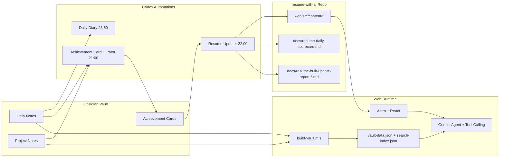
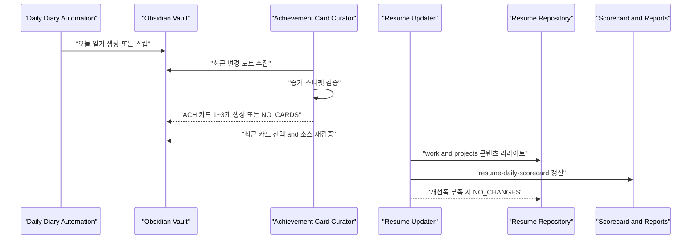

# Resume with AI

> Obsidian 작업 로그를 기반으로 이력서를 자동 갱신하고, 방문자는 AI 채팅으로 근거 기반 답변을 확인할 수 있는 프로젝트입니다.

- 기간: 2025.01 ~
- 유형: 1인 개인 프로젝트
- 배포: [resume-with-ai.gihwan-dev.com](https://resume-with-ai.gihwan-dev.com)

## 핵심 목표

- 이력서 업데이트를 수동 편집에서 자동 파이프라인으로 전환
- 모든 성과 문장을 Obsidian 근거 문서와 연결
- 웹에서 질문 시 AI가 실제 문서 검색 결과에 기반해 답변

## 아키텍처 개요



## 일일 자동화 흐름



## Automation 구성

| Automation | 역할 | 주요 입력 | 주요 출력 | 상태 |
|---|---|---|---|---|
| Daily Diary Automation | Daily Notes 자동 작성 | Obsidian 최근 작업 기록 | 당일 일기 문서 | ACTIVE |
| Achievement Card Curator | 고신호 성과 카드 추출 | Daily/Projects 노트 | `ACH-*` 카드 + 일일 로그 | ACTIVE |
| Resume Updater | 카드 기반 이력서 갱신 | 최근 14일 성과 카드 | `web/src/content/*` + `docs/resume-daily-scorecard.md` + 운영 리포트 | ACTIVE |

## 오늘 기준 운영 스냅샷 (2026-02-15)

- `BULK_REFRESH` 실행 결과: 점수 18/30 -> 24/30 (Delta +6)
- 사용 카드: `ACH-20260206-001`, `ACH-20260128-001`, `ACH-20260128-002`, `ACH-20260213-001`
- 상세 리포트: `docs/resume-bulk-update-report-2026-02-15.md`
- 누적 스코어 로그: `docs/resume-daily-scorecard.md`

## 웹 AI 채팅 런타임

- 데이터 소스: `web/vault/` 서브모듈(Obsidian)
- 빌드 단계: `web/scripts/build-vault.mjs`로 검색용 JSON 사전 생성
- 에이전트: Gemini + Vercel AI SDK tool-calling
- 검색 도구: `searchDocuments` -> `readDocument` -> `answer`
- 신뢰성 장치: Source Tracker로 답변 출처 ID 검증

## 로컬 실행

사전 준비

- Node.js 18+
- pnpm

설치

```bash
git clone https://github.com/gihwan-dev/resume-with-ai.git
cd resume-with-ai
git submodule update --init --recursive
cd web
pnpm install
cp .env.example .env
```

개발 서버

```bash
pnpm dev
```

빌드

```bash
pnpm build
```

테스트

```bash
pnpm test
pnpm test:run
pnpm test:coverage
```

## 주요 문서

- `docs/resume-engineering-guide-2025.md`
- `docs/resume-daily-scorecard.md`
- `docs/resume-bulk-update-report-2026-02-15.md`
- `docs/milestone.md`
