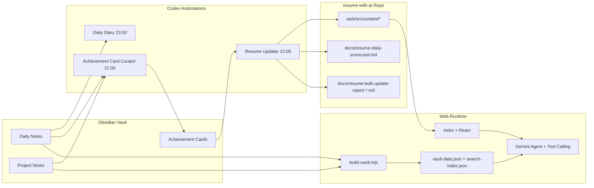

# Resume with AI

> Obsidian 작업 로그를 기반으로 이력서를 자동 갱신하고, 방문자는 AI 채팅으로 근거 기반 답변을 확인할 수 있는 프로젝트입니다.

- 기간: 2025.01 ~
- 유형: 1인 개인 프로젝트
- 배포: [resume-with-ai.gihwan-dev.com](https://resume-with-ai.gihwan-dev.com)

## 현재 제품 범위 (resume-only)

- 메인 페이지는 이력서 단일 경험(`/`)으로 제공됩니다.
- 과거 상세 케이스 스터디 라우트(`/portfolio`, `/portfolio/*`)는 홈으로 리다이렉트됩니다.
- AI 채팅, PDF 다운로드, 섹션 뷰 analytics는 유지됩니다.

## AI 모델/도구 정책

- 메인 채팅(`/api/chat`): Vertex AI `global` endpoint + `gemini-3.1-pro-preview`
- 후속 질문(`/api/followup`): `gemini-2.0-flash` 유지
- 도구 호출 정책: Step 0에서 검색 도구를 `required`로 강제하고, Step 1+는 `auto`로 모델이 `search/read/answer`를 자율 선택
- 반복 도구 호출은 도구를 강제로 차단하지 않고 시스템 프롬프트에 soft guidance를 추가

## 아키텍처 개요


```mermaid
flowchart LR
  subgraph Vault["Obsidian Vault"]
    N1["Daily Notes"]
    N2["Project Notes"]
    N3["Achievement Cards"]
  end

  subgraph Auto["Codex Automations"]
    A1["Daily Diary 23:50"]
    A2["Achievement Card Curator 21:00"]
    A3["Resume Updater 22:00"]
  end

  subgraph Repo["resume-with-ai Repo"]
    R1["web/src/content/*"]
    R2["docs/resume-daily-scorecard.md"]
    R3["docs/resume-bulk-update-report-*.md"]
  end

  subgraph Runtime["Web Runtime"]
    W1["Astro + React"]
    W2["build-vault.mjs"]
    W3["vault-data.json + search-index.json"]
    W4["Gemini Agent + Tool Calling"]
  end

  N1 --> A1
  N1 --> A2
  N2 --> A2
  A2 --> N3
  N3 --> A3
  A3 --> R1
  A3 --> R2
  A3 --> R3
  N1 --> W2
  N2 --> W2
  W2 --> W3
  W3 --> W4
  R1 --> W1
  W1 --> W4
```

## 로컬 실행

사전 준비

- Node.js 18+
- pnpm

설치

```bash
git clone https://github.com/gihwan-dev/resume-with-ai.git
cd resume-with-ai
git submodule update --init --recursive
cd web
pnpm install
cp .env.example .env
```

개발 서버

```bash
pnpm dev
```

빌드

```bash
pnpm build
```

테스트

```bash
pnpm test
pnpm test:run
pnpm test:coverage
pnpm test:e2e
```

## 주요 문서

- `docs/resume-engineering-guide-2025.md`
- `docs/resume-daily-scorecard.md`
- `docs/resume-hiring-optimization-direction-2026-02-22.md` (이전 구조 분석 기록)
- `docs/resume-phase1-baseline-snapshot-2026-02-22.md` (이전 구조 기준선)
- `docs/resume-phase1-acceptance-criteria-30s-scan-2026-02-22.md` (이전 수용 기준)
